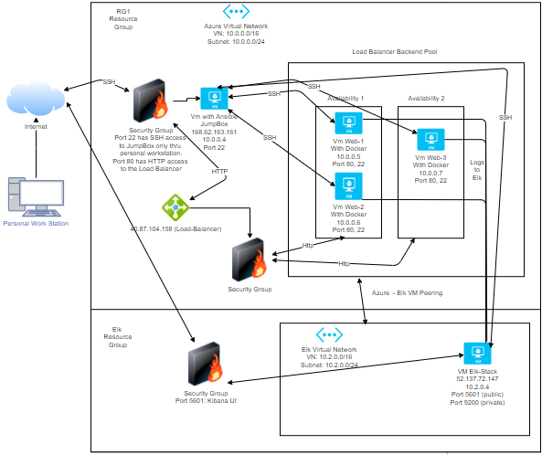

# Project_1
Creation of ELK stack and ansible containers
## Automated ELK Stack Deployment
The files in this repository were used to configure the network depicted below.

These files have been tested and used to generate a live ELK deployment on Azure. They can be used to either recreate the entire deployment pictured above. Alternatively, select portions of the ansible file may be used to install only certain pieces of it, such as Filebeat.

  * Elk Install
  * DVWA
  * FileBeat
  
This document contains the following details:
  * Description of the Topology
  * Access Policies
  * ELK Configuration
     * Beats in Use
     * Machines Being Monitored
  * How to Use the Ansible Build
  
  ### Description of the Topology
  
The main purpose of this network is to expose a load-balanced and monitored instance of DVWA, the D*mn Vulnerable Web Application.

Load balancing ensures that the application will be highly available, in addition to restricting access to the network.

  * Load Balancers are the access point from a service that serves multiple machines. This will allow the high availability models to function properly. 
  * The advantage of the jump box server is to provide a gateway to the network. The only way to access it is through a ssh key. 
  
Integrating an ELK server allows users to easily monitor the vulnerable VMs for changes to the log files and system system resources.

  * Filebeat is used to monitor system logs and also to forward any changes to Elasticsearch Host. 
  * Metricbeat records metrics and system resources usages to display in Elasticsearch.
  
The configuration details of each machine may be found below. 

| Name    | Function    | IP Address    | Operating System |
| ------- | -----       | -----         | -------          |
| Jump Box | Gateway    | 10.0.0.4      | Ubuntu           |
| Web-1 | Web Server | 10.0.0.5 | Ubuntu                   |
| Web-2 | Web Server | 10.0.0.6 | Ubuntu |
| Web-3  | Web Server | 10.0.0.7 | Ubuntu |
| Elk Stack | Elasticsearch Stack | 10.2.0.4 | Ubuntu

### Access Policies
The machines on the internal network are not exposed to the public Internet.
Only the Jump Box machine can accept connections from the Internet. Access to this machine is only allowed from the following IP addresses:
  * 71.127.32.206
  
Machines within the network can only be accessed by the Jump Box.
  * Jump Box	
      *Public IP: 168.62.163.161
      *Private IP: 10.0.0.4
      
A summary of the access policies in place can be found in the table below.

| Name | Publicly Accessible | Allowed IP Addresses
| ---- | ------| ------|
| Jump Box | Yes - SSH - 22 | 71.127.32.206
| Web-1,2,3 | No | Web LB - 40.87.104.158
| Web LB | Yes - HTTP - 80 | *
| Elk Stack | Yes - Kibana - 5601 | *
| Elk Stack | Yes HTTP API - 9200 | 10.0.0.0/16\

### Elk Configuration

Ansible was used to automate configuration of the ELK machine. No configuration was performed manually, which is advantageous because...
  * It reduces configuration errors and also provides full automation of specific servers.
  
The playbook implements the following tasks:
  * Install Docker: Installs the core docker code to the remote server.
  * Install Python3_pip: Pip is an installation mobile that allows for additional docker modules to be installed easier.
  * Docker module: Tells the previous PIP module to install the necessary docker component modules
  * Increase Memory: Increases the memory to handle everything need in the Elk stack
  * Download and Launch ELK Container: this will download the ELK docker container and initialize it with the specified ports being published.
  
The following screenshot displays the result of running docker ps after successfully configuring the ELK instance.

Target Machines & Beats
This ELK server is configured to monitor the following machines:
10.0.0.5
10.0.0.6
10.0.0.7
We have installed the following Beats on these machines:
Filebeat and Metricbeat were installed on Web-1, Web-2, and Web-3. 
These Beats allow us to collect the following information from each machine:
Filebeat collects system events such as logins to see who is accessing the system.
Metricbeat collects information such as cpu usage and memory. Ity helps to keep track of your system and to make sure nothing is using more than it should. 
Using the Playbook
In order to use the playbook, you will need to have an Ansible control node already configured. Assuming you have such a control node provisioned:
SSH into the control node and follow the steps below:
Copy the _____ file to _____.
Update the _____ file to include...
Run the playbook, and navigate to ____ to check that the installation worked as expected.
TODO: Answer the following questions to fill in the blanks:
Copy the elk-install.,yml file to /etc/ansible/roles/elk-install.yml
Update the hosts file to include the attribute, then include your destination ip of the ELK server.    
[elk]
10.2.0.4 ansible_python_interpreter=/usr/bin/python3

The url is http://[your_elk_server_ip]:5601/app/kibana
